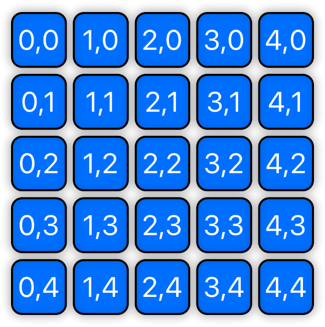
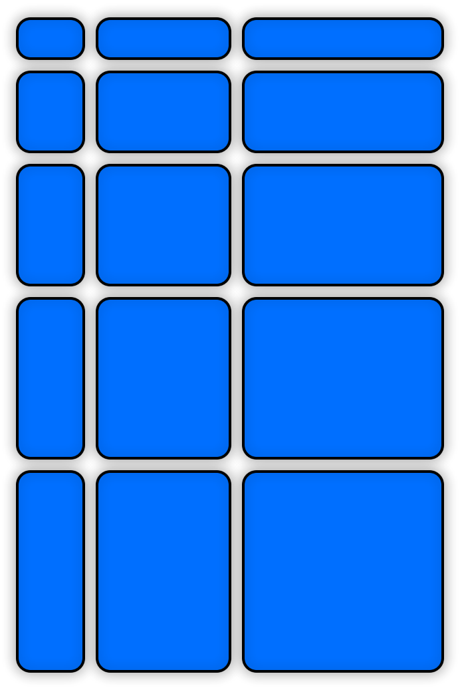
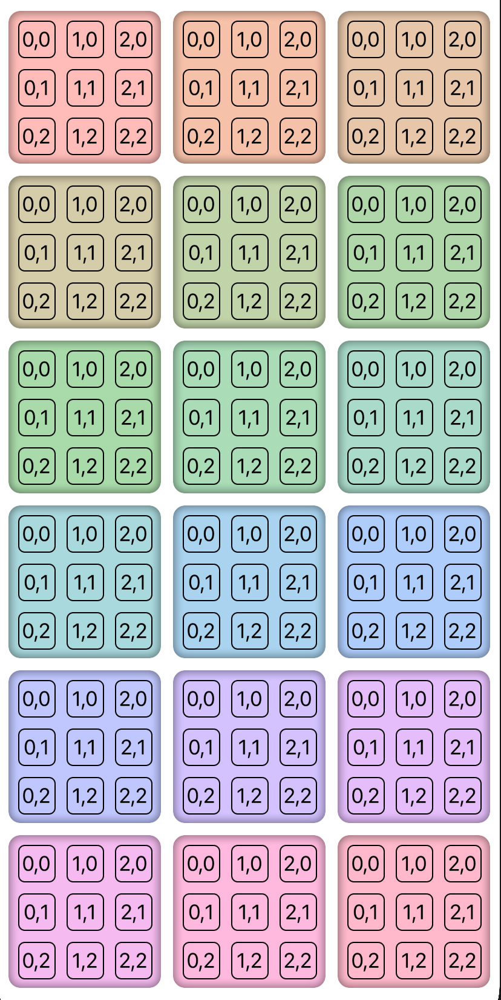

# GridView

It's common in `SwiftUI` to create layouts in grids. This rather repetitive boiler-plate of nested `ForEach` views distracts from the intent of the code. `GridView` abstracts this logic into a container view and - as with the case with `ForEach` provides the context of each cell's column and row allowing the calling code to style each component view accordingly.

A simple 3x3 grid is created like so:

```swift
GridView(5, spacing: 8) { column, row in
    TitleText("\(column),\(row)", .white)
        .greedyFrame()
        .clipRoundedRectangleWithStroke(10, .black, lineWidth: 2, fill: Color.blue)
        .shadow(5)                      
}
.frame(300, 300)
```

Which produces the following output:

<p align="center">

</p>

You can control the individual size of the cells by specifying the exact size of the components. Perhaps based on the column and row, for example:

```swift
GridView(3, 5, spacing: 10) { column, row in
    Frame(50 * (column + 1), 30 * (row + 1), .blue)
        .clipRoundedRectangleWithStroke(10, .black, lineWidth: 2)
        .shadow(5)
}
```

Resulting in this grid:

<p align="center">

</p>

Of course grids within grids are just as easy. The following output is produced with the gist found [here][gist-nested-grids]:

<p align="center">

</p>

<!---
gists:
--->

[gist-nested-grids]: https://gist.github.com/CodeSlicing/9266dc4cd23d58e81d4cc52999de2def
