# Inner Shadows

With inner shadows in [PureSwiftUITools][pure-swift-ui-tools] you can easily create interesting looking UIs with a little depth to them:

<p align="center">
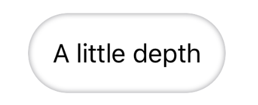
</p>

Or maybe a lot?

<p align="center">
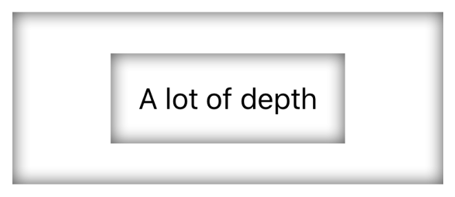
</p>

Clearly this is an area where a less-is-more approach would perhaps be a wise one, but I'm not here to tell you how to write fantastic and engaging user interfaces, I'm just giving you some tools; use them as you see fit.

There are various ways in which inner shadows can be applied in [PureSwiftUI][pure-swift-ui] and this section will go through each in turn. It is important to note that the available options depend on the type on which the modifier is directly applied. So for `Shape` the arguments will be different to those for an `Image`, `SFSymbol`, `Text`, or a `View`.

  - [API](#api)
  - [Shapes](#shapes)
  - [SF Symbols and Alpha](#sf-symbols-and-alpha)
  - [Views](#views)
  - [Text](#text)
  - [Configuring the Shadow](#configuring-the-shadow)
  - [Animating the Shadow](#animating-the-shadow)
  - [Known Problems and Workarounds](#known-problems-and-workarounds)
    - [Foreground Color on Text](#foreground-color-on-text)
    - [Scaling Contents](#scaling-contents)
    - [Clipping of Stroked Shapes](#clipping-of-stroked-shapes)
    - [Error on `clipShape` for Masked Inner Shadows](#error-on-clipshape-for-masked-inner-shadows)

## API

Regardless of the type on which the inner shadow is being applied, the general structure of the modifier is the same. You pass in the *content*
and the *configuration* for the shadow:

```swift
let content = Color.white
let config = PSInnerShadowConfig(radius: 3, offset: .point(1))
Something()
    .ps_innerShadow(content, config)
    // which is equivalent to:
    .ps_innerShadow(content, radius: 3, offset: .point(1))
    // or if you want a transparent background with no shadow offset
    .ps_innerShadow(radius: 3)
```

The content is a `View` so you are not restricted to `ShapeStyle` as you would be with a normal shape fill. This defines the background that is going to have the inner shadow applied to it. If you want a transparent background, you can either provide `Color.clear` as the content, or omit the argument altogether.

In the case of placing an inner shadow on a `View`, the `content` parameter should consist of a shape as well as the content. I will go into more detail when talking specifically about [Views](#views).

## Shapes

There are two ways of decorating shapes with inner shadows: You can either decorate the fill or the stroke. However, since a stroke on a shape is actually just another shape, they are *ultimately* the same thing. The inner shadow modifier on a `Shape` takes either a `FillAndContent` or a `StrokeAndContent` which determine whether or not the inner shadow is created on the stroke of the shape or the fill.

Let's put an inner shadow on the stroke of a `Circle`:

```swift
let gradient = LinearGradient([.red, .yellow], to: .topTrailing)
...
Circle().inset(by: 10)
    .ps_innerShadow(.stroke(gradient, lineWidth: 20), radius: 4)
    .frame(100)
```

which gives us:

<p align="center">

</p>

I'll go into more detail as to why we need to inset this shape in the [caveats](#known-problems-and-workarounds) section.

If we wanted to put an inner shadow with a fill, we would do it like this:

```swift
Circle()
    .ps_innerShadow(.fill(gradient), radius: 4)
    .frame(100)
```

and we get:

<p align="center">
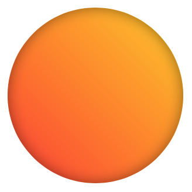
</p>

As you can see, the API relies on either passing a stroke or a fill configuration to the inner shadow modifier.

There are a couple of issues when specifically working with inner shadows on strokes, so please refer to the [known problems and workarounds](#known-problems-and-workarounds) section so you are aware of them.

## Views

When decorating a `View` with an inner shadow, you must specify the shape for the shadow. This shape will fill the view which is why the inner shadow modifier takes a content argument as well as a shape so it can provide the background at the same time. The advantage of doing it this way is that it will clip the background to the shape in question. So let's take the example at the top of the page and give a little bit of depth a bit of pizzazz with a gradient background. You can achieve this by passing a gradient to the capsule shape configuration as follows:

```swift
private let gradient = LinearGradient([.red, .yellow], to: .trailing)
...
Text("A little depth")
    .padding()
    .ps_innerShadow(.capsule(gradient), radius: 2)
```

and you get this simply spectacular result:

<p align="center">
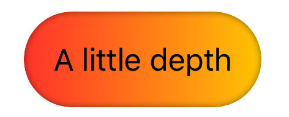
</p>

This is just an example of how *any* `View` can be modified with an inner shadow, including `VStack`s, and of course `Images` which opens up a big door of creativity through which to walk. Let's say for example you want to use inner shadows for profile pictures or something.

There are two main ways of doing this - one has a small advantage discussed in the section on [known problems](#known-problems-and-workarounds) - the first way is to add an inner shadow directly to the image `View`:

```swift
Image("profile-pic-\(index)")
    .resizedToFill(90)
    .ps_innerShadow(.roundedRectangle(10), radius: 5, intensity: 0.6)
    .clipShape(RoundedRectangle(10))
```

Giving us:

<p align="center">
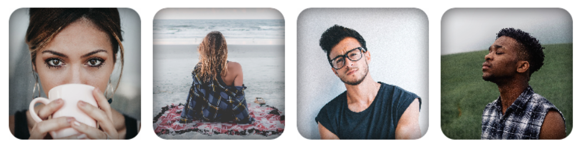
</p>

Note that in this case, since there is some contrast in the images, I have increased the intensity slightly to 0.6 from a default of 0.56. Now, looking at the code you can see that I have to manually clip the shape to a rounded rectangle. This is due to the way inner shadows are implemented and stems from a bug in the `SwiftUI` framework at the time of writing meaning I'm forced to code it in such a way that I cannot clip the overall `View` internally. Not a huge hardship I guess, but you can achieve the same result by applying an inner shadow to a `Frame` and using the content argument of the inner shadow itself to be the image in question like so:

```swift
Frame(90)
    .ps_innerShadow(.roundedRectangle(10, Image("profile-pic-\(index)").resizedToFill()), radius: 5, intensity: 0.6)
```

Which has the advantage of being somewhat more concise and ends up with the same output. The benefit I mentioned also pertains to this technique having fewer masking artifacts as discussed [here](#known-problems-and-workarounds).

## SF Symbols and Alpha

Although inner shadows can be added to an `Image` in the same way as can be added to an `SFSymbol`, this usage is really meant just for `SFSymbols` or other images that have transparency. It's the alpha that's the key here (literally), so let's take a look at what that means.

`SFSymbols` are essentially vector shapes consisting of opaque and transparent areas. This can be exploited for use with inner shadows and is used as follows:

```swift
private struct RatingView: View {
    var body: some View {
        HStack(spacing: 20) {
            ForEach(0..<5) { index in
                SFSymbol(.star_fill)
                    .ps_innerShadow(gradient.scale(2).opacityIf(index > 3, 0), radius: 2, offset: .point(1))
                    .fontSize(45, weight: .bold)
            }
        }
    }
}
```

to generate the following rating view:

<p align="center">
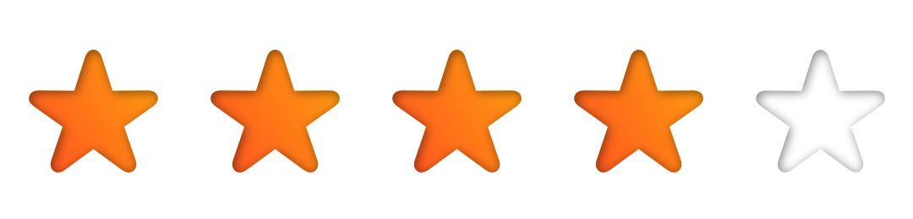
</p>

A couple of takeaways from this code: I'm offsetting the shadow in this example to give the shadow a sense of direction. If you wanted to explore a directions of light a little more, you could create a background with a gradient to give the illusion of a light source:

```swift
let backgroundGradient = LinearGradient([Color(white: 0.9), Color(white: 0.5)], from: .topLeading)
private struct MicButton2View: View {
    var body: some View {
        SFSymbol(.star_fill)
            .ps_innerShadow(gradient.scale(2), radius: 2, offset: 1, angle: .bottomTrailing)
            .fontSize(45, weight: .bold)
            .frame(90)
            .ps_innerShadow(.circle(backgroundGradient), radius: 3, offset: 1, angle: .bottomTrailing)
    }
}
```

and gives you:

<p align="center">

</p>

The other thing worth mentioning is the fact that I'm scaling up the gradient to be used as the background for the `SFSymbol`. The reason this is necessary is covered in the [caveats](#known-problems-and-workarounds) section so take a look.

You could also build some kind of navigation, perhaps, where a filled background indicates the selected state:

<p align="center">

</p>

which is achieved thus:

```swift
private struct NavigationView: View {
    @State private var selectedIndex = 0
    ...
    let symbols: [SFSymbolName] = [.envelope_fill, .paperclip, .person_2_fill]
    var body: some View {
        HStack(spacing: 50) {
            ForEach(0..<symbols.count) { index in
                SFSymbol(self.symbols[index])
                    .ps_innerShadow(gradient.scale(2).opacityIfNot(self.selectedIndex == index, 0), radius: 1, offset: .point(0.5))
            }
            .fontSize(45, weight: .bold)
        }
        ...
        // animation code omitted
    }
}
```

I have omitted the animation code to fake the selection for brevity. As you can see, this effect is trivial although it does bring with it some accessibility challenges to keep in mind.

## Text

Inner shadows on text works in much the same way as `SFSymbol`s. As long as you call the modifier directly on the `Text` component, the effect will be applied to the text itself:

```swift
Text("DEPTH")
    .ps_innerShadow(gradient, radius: 2)
    .fontSize(60, weight: .bold)
```

and we have:

<p align="center">

</p>

## Configuring the Shadow

The inner shadow can be configured with a `radius`, an `offset`, and an `intensity` or `shadowColor`. An important difference in the way inner shadows are implemented and native shadows in `SwiftUI` is that inner shadows can only be used in a way that darkens the result, even when specifying the `shadowColor`. This is because, for various reasons, the effect is ultimately implemented using the `multiply` blend-mode under the covers.

The `radius` parameter is equivalent to the `radius` parameter for the native shadow effect. In reality this is the `radius` of the blur that's applied to the mask that supplies the inner shadow.

The `offset` can be defined in two ways. You can either directly specify an offset defined by a `CGPoint`, or you can specify an offset length and an angle. The following are equivalent:

```swift
.ps_innerShadow(radius: 3, offset: 1, angle: .trailing) // or angle: 90.degrees
// is equivalent to
.ps_innerShadow(radius: 3, offset: .x(1))
// since .x(v) is a static constructor for CGPoint resulting in CGPoint(x: v, y: 0)
```

The inner shadow `intensity` determines the darkness of the shadow from 0 to 1. This is useful in situations where the color or contrast surrounding the component is higher meaning the shadow effect needs a little more oomph to be noticeable.

As hinted at previously, you can also tint the shadow by specifying the `shadowColor`. This will only tint the shadow, however, since as explained earlier the blend is a multiplication. Darker colors will have more of an impact for this same reason.

## Animating the Shadow

Unlike native shadows in `SwiftUI`, inner shadows can be animated. You can animate the radius of the shadow and the offset and / or angle in which the shadow falls.

<p align="center">

</p>

I'm not sure how often animated shadows would be desirable in a UI, but it certainly looks cool.

## Known Problems and Workarounds

This section will discuss a number of issues associated with inner shadows. These are all the result of current limitations of the `SwiftUI` framework, or actual bugs. There are workarounds for all but one of them at this time.

### Foreground Color on Text

If you are applying an inner shadow to a `Text` component, you must not specify a foreground color on it. This is because the result of applying a `foregroundColor` modifier to a `Text` component is another `Text` component with a foreground color. This is important because once a `Text` element has had a foreground color applied to it, you cannot change it.

Internally, the implementation for inner shadows on text requires that I'm able to use various foreground colors on versions of the `Text` component being modified. Therefore the effect simply won't work if a foreground color has already been applied.

So if you want green text with an inner shadow, the following will not work:

```swift
// using PureSwiftUI convenience constructor:
CustomText("Green Text", 60, .green, .bold)
    .ps_innerShadow(radius: 2, offset: .point(1))

// natively in SwiftUI
Text("Green Text")
    .foregroundColor(.green)
    .ps_innerShadow(radius: 2, offset: .point(1))
    .font(Font.system(size: 60).weight(.bold))
```

The [PureSwiftUI][pure-swift-ui] convenience constructor internally sets the foreground color of the Text and in the native example we are explicitly setting it and it cannot work as expected. The result will be:

<p align="center">

</p>

Not only are the inner shadows not working, but you can see that the color is darker than it should be as a result of the multiplication blend-mode going on under the covers.

Instead we should pass in the `Color` as the content argument to the inner shadow modifier and avoid setting the foreground color even implicitly, like so:

```swift
Text("Green Text")
    .ps_innerShadow(Color.green, radius: 2, offset: .point(1))
    .fontSize(60, weight: .bold)
```

And it works!

<p align="center">

</p>

### Scaling Contents

As I mentioned in the section on [SF Symbols](#sf-symbols-and-alpha), I had to scale up the content in order for it to work correctly. I'll flesh that out a bit here.

The problem is that the content backing the symbol is going to be restricted to the bounding rectangle for that `View`. When you use SF Symbols they will extend *beyond this boundary*. So, if you do not scale up the content, you will run into problems.

So let's give this a try with the following code (using the gradient defined in an earlier example):

```swift
SFSymbol(.music_house_fill)
    .ps_innerShadow(gradient, radius: 2, offset: .point(1))
    .fontSize(60, weight: .bold)
```

Seems legit, but the output would be:

<p align="center">

</p>

So you can see that the content does not extend to cover the full extent of the symbol. It's clearer to see what's going on if I draw a line around the border of the symbol by adding:

```swift
    .border(Color.black, width: 1)
```

to get this:

<p align="center">

</p>

So you can see that the content needs to be scaled up in order to cover the full extent of the symbol, and we do that like this:

```swift
SFSymbol(.music_house_fill)
    .ps_innerShadow(gradient.scale(1.8), radius: 2, offset: .point(1))
    .fontSize(60, weight: .bold)
```

Much better:

<p align="center">

</p>

Remember that you only have to scale the content as much as needed for the symbol in question, so that might be more or less than the 1.8 factor I've used in this example so play around with it to see what works for you.

### Clipping of Stroked Shapes

There are a couple of caveats when working with inner shadows on strokes of a `Shape` so let's talk about them now.

The first is what happens when you draw a shape that reaches the bounds of the canvas since adding a stroke will result in a shape that extends beyond that canvas. This presents problems in the current implementation of `SwiftUI` because inner shadows for shapes rely on using a `.drawingGroup()` modifier. Unfortunately when you apply this modifier to a `View` it restricts the contents to the bounding box for that `View`. So what does that mean for us in a practical sense?

This next example uses a `Shape` defined like so:

```swift
private struct DiamondShape: Shape {
    let inset: CGFloat
    func path(in rect: CGRect) -> Path {
        var path = Path()
        var layout = LayoutGuide.polar(rect.inset(inset), rings: 1, segments: 4)
        path.move(layout.top)
        for index in 1...layout.yCount {
            path.line(layout[1, index])
        }
        path.closeSubpath()
        return path
    }
}
```

which is essentially a diamond that extends to the edges of the canvas. Note the `inset` property of the `Shape` because that's going to be important going forward. Now I'm going to take that shape and apply an inner shadow to the stroke like this:

```swift
let shadowConfig = PSInnerShadowConfig(radius: 1.5, offset: .point(0.5))
...
DiamondShape(inset: 0)
    .ps_innerShadow(.stroke(gradient, lineWidth: 20), shadowConfig)
```

Since we're using a stroke with this `Shape` we're going to run into problems since this will push the resulting `Shape` beyond the boundary. You can see the trouble here:

<p align="center">

</p>

Oh dear; not what we wanted. The parts of the shape that extend beyond the bounds of the `View` have been clipped! There is currently no way to fix this without making some adjustments. One thing you can do, and is what I would recommend, is to inset the `CGRect` being used to draw the original shape. Fortunately this is made easy in [PureSwiftUI][pure-swift-ui] as you can see in the `Shape` implementation above. So using an inset and a value for stroke that roughly maintains the original proportions and then scaling it up a bit to match the original:

```swift
DiamondShape(inset: 13)
    .ps_innerShadow(.stroke(gradient, lineWidth: 16), shadowConfig)
    .scale(1.4)
```

you can achieve the desired effect:

<p align="center">

</p>

Almost... This is good, but can you see the glitch at the top of the diamond? This is *also* due to the fact that a `.drawingGroup()` modifier is being used internally.

Unfortunately, there's no workaround for this if you want to use sharp corners, but you can avoid the ugly artifact by using a rounded line join with the following stroke style:

```swift
DiamondShape(inset: 13)
    .ps_innerShadow(.stroke(gradient, style: .init(lineWidth: 16, lineJoin: .round)), shadowConfig)
    .scale(1.4)
```

So although it's not a workaround as such, it's still prettier:

<p align="center">

</p>

Before you get too down in the dumps about this last problem, it's actually a bit of an outlier when constructing shapes and I picked this example specifically to show off the issue. It also only happens at the join point when closing a sub-path and may be fixed in a future release of `SwiftUI` - if that happens I'll gladly update this page.

### Error on `clipShape` for Masked Inner Shadows

Another issue of which I'm aware is due to another bug in the current `SwiftUI` implementation. It occurs when you apply a clipping shape to a `View` hierarchy to which a mask has been applied somewhere. Since `Text` and `Image` inner shadows are implemented using masks, you can potentially run into this problem when using them.

It doesn't happen for *all* clip shapes either so I'll tell you what to look out for. To demonstrate we can look at an example that could potentially come up. So maybe we want to have an inner shadow on an SF symbol and then clip a `Circle` around that view and raise it with a shadow to create a pause button like this:

<p align="center">
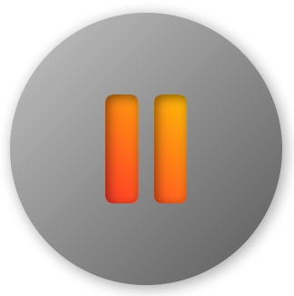
</p>

The natural instinct would be to code it like this:

```swift
private let gradient = LinearGradient([.red, .yellow], to: .topTrailing)
private let backgroundGradient = LinearGradient([Color(white: 0.8), Color(white: 0.4)], to: .bottomTrailing)
...
SFSymbol(.pause_fill)
    .ps_innerShadow(gradient.scale(1.2), radius: 2, offset: .point(1))
    .fontSize(50)
    .frame(100)
    .background(backgroundGradient)
    .clipCircle() // PureSwiftUI equivalent to .clipShape(Circle())
    .shadow(3, x: 1, y: 1)
```

This will not work and will crash! It does not work for the same reason the following code does not work in the current implementation of `SwiftUI`:

```swift
Color.red.mask(Circle())
    .clipCircle()
```

which seems so simple yet does not run. Internally, inner shadows on `Image`s such as SF symbols are implemented using masks. So when you try to clip them you may run into problems like this and the insidious part is that there absolutely *zero* indication as to what's causing the problem. At least in Xcode. All you get is the "...may have crashed" error. You get more of a clue as to the root of the problem when you run it in Playgrounds on the iPad where it says "Could not cast value of type 'CALayer' to 'SwiftUI.MaskLayer' so you can be sure this is a problem with the framework that may or may not be fixed down the road.

Fortunately there are a couple of workarounds for this once you know what's causing the problem. The easiest way is to simply use a mask instead of a clip shape:

```swift
SFSymbol(.pause_fill)
    .ps_innerShadow(gradient.scale(1.2), radius: 2, offset: .point(1))
    .fontSize(50)
    .frame(100)
    .background(backgroundGradient)
    .mask(Circle()) // replaces .clipCircle()
    .shadow(3, x: 1, y: 1)
```

or you can use a clip shape for the background and stick it in a `ZStack`:

```swift
ZStack {
    Frame(100)
        .background(backgroundGradient)
        .clipCircle()
        .shadow(3, x: 1, y: 1)
    SFSymbol(.pause_fill)
        .ps_innerShadow(gradient.scale(1.2), radius: 2, offset: .point(1))
        .fontSize(50)
}
```

If performance is your main concern, the evidence is that clipping with a shape performs somewhat better than a mask although functionally they are the same. Not a difference that you'll notice if you're only talking about a handful of views so for the most part it really comes down to personal preference here.

### Masking Artifacts

When we were designing some fancy profile picture thumbnails above I mentioned something about masking artifacts so let's look at that.

In the [example](#views) everything looked just fine because it was on a white background. But what if we did the same thing on a more interesting background like a gray ramp like this:

<p align="center">
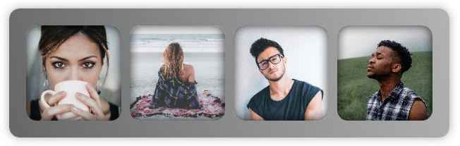
</p>

It may not be obvious so I'll zoom in a bit:

<p align="center">
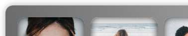
</p>

So there you can see some aliasing artifacts that look a bit messy. I haven't found a way to address this internally yet but I mentioned that the second technique for creating these profile pics suffered less from this problem by using this code:

```swift
Frame(90)
    .ps_innerShadow(.roundedRectangle(10, Image("profile-pic-\(index)").resizedToFill()), radius: 5, intensity: 0.8)
```

And the result is:

<p align="center">
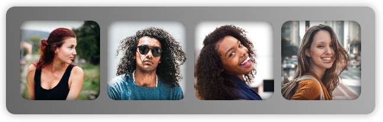
</p>

and zoomed in looks much better:

<p align="center">
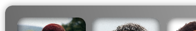
</p>

Oh, when using a darker background you might need to bump up the intensity of the shadows to bring them out as I've done here using a value of 0.8.

So that's it for inner shadows. If you have any questions, feel free to [ask][codeslice-twitter]. 


**Image Credits:**

<sub><sup>[Mubariz Mehdizadeh](https://unsplash.com/@mehdizadeh?utm_source=unsplash&utm_medium=referral&utm_content=creditCopyText)</sup></sub><br>
<sub><sup>[Isaiah McClean](https://unsplash.com/@isaiahmcclean?utm_source=unsplash&utm_medium=referral&utm_content=creditCopyText)</sup></sub><br>
<sub><sup>[Štefan Štefančík](https://unsplash.com/@cikstefan?utm_source=unsplash&utm_medium=referral&utm_content=creditCopyText)</sup></sub><br>
<sub><sup>[Candice Picard](https://unsplash.com/@candice_picard?utm_source=unsplash&utm_medium=referral&utm_content=creditCopyText)</sup></sub><br>
<sub><sup>[J'Waye Covington](https://unsplash.com/@jwayecovington?utm_source=unsplash&utm_medium=referral&utm_content=creditCopyText)</sup></sub><br>
<sub><sup>[Guilherme Stecanella](https://unsplash.com/@guilhermestecanella?utm_source=unsplash&utm_medium=referral&utm_content=creditCopyText)</sup></sub><br>
<sub><sup>[Cody Black](https://unsplash.com/@cblack09?utm_source=unsplash&utm_medium=referral&utm_content=creditCopyText)</sup></sub><br>
<sub><sup>[Tyler Nix](https://unsplash.com/@jtylernix?utm_source=unsplash&utm_medium=referral&utm_content=creditCopyText)</sup></sub><br>

<!---
 external links:
--->

[pure-swift-ui]: https://github.com/CodeSlicing/pure-swift-ui
[pure-swift-ui-tools]: https://github.com/CodeSlicing/pure-swift-ui-tools
[swift-ui]: https://developer.apple.com/xcode/swiftui/
[codeslice-twitter]: https://twitter.com/CodeSlice

<!---
gists:
--->

[gist-shield]: https://gist.github.com/CodeSlicing/af02bd37dd60252fd39acaf95d28a7d0

<!---
 local docs:
--->

[docs-layout-guides]: ../LayoutGuides/layout-guides.md
