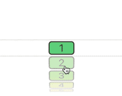
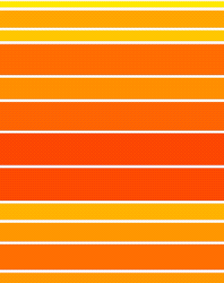

# GradientMap

While the gradients we have at our disposal in `SwiftUI` are numerous, we don't have a way of extracting colours from those gradients for use in situations where we might want to represent state based on a color *from* those gradients.

In other words if we have a selection of options, for example, where each option represents a particular severity, unfortunately we can't create a [LinearGradient][linear-gradient] and then pick color from it at a specific location. `GradientMap` addresses this issue by providing a map of interpolated colors based on the array of colors with which it is initialized.

A picture paints a thousand words, so here's an example. Let's say you have a picker where each value corresponds a more or less severe option. The severity might be represented by a gradient of colors from green, to yellow, to red, like so:

<p align="center">

</p>

Using `GradientMap` could produce this in the following way:

```swift
private let gradientMap = GradientMap([.green, .yellow, .red], withResolution: 10)

struct PickerSeverityDemo: View {
    var choices = 0..<10
    @State private var choice = 5
    var body: some View {
        VStack {
            Picker("Severity Picker", selection: self.$choice) {
                ForEach(choices) { choice in
                    Text((choice + 1).asString)
                    .width(50)
                        .backgroundColor(gradientMap.colorAt(choice, default: .white))
                        .clipRoundedRectangleWithStroke(5, .black, lineWidth: 2)
                }
            }
            .labelsHidden()
        }
    }
}
```

You are not, of course, restricted to representing a certain contextual *level*; you can pull a color out of the map to represent anything you like. For example, you could base the color of a view on its size. This next demonstration shows each block being colored depending on the individual heights.

<p align="center">

</p>

You can find the gist [here][gist-rgb-gradient-map-based-on-size] but the code driving the color is as follows:

```swift
...
  let randomValue = 1.0.random()
        return Rectangle()
            .fillColor(gradientMap.colorAt(randomValue))
...
```

As you can see, the flexibility here is only limited by your imagination.

You can access the range of colors in `GradientMap` in various ways. You can access `Color` values by using the subscript on `GradientMap` like so:

```swift
// subscript returns an optional Color so you can use nil coalescing
let color1 = gradientMap[index] ?? .white

// or provide a default
let color2 = gradientMap[index, default: .white]
```

Normal usage, though, would be by accessing the `Color` of the `GradientMap` to be used directly in a view as with the previous example as follows:

```swift
...
    // fraction is a Double from 0 to 1
    .backgroundColor(gradientMap.colorAt(fraction, default: .white))
```

<!---
external links:
--->

[linear-gradient]: https://developer.apple.com/documentation/swiftui/lineargradient

<!---
gists:
--->

[gist-rgb-gradient-map-based-on-size]: https://gist.github.com/CodeSlicing/c4d59618d66117a502c8ed8dcfb98c4b
